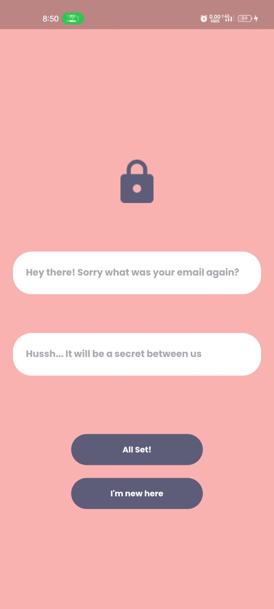
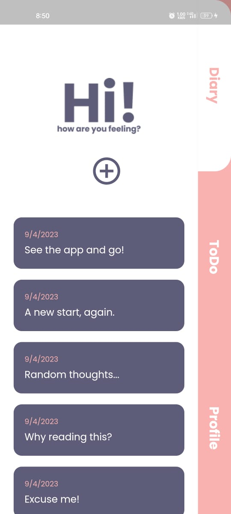

# My LifeBook

Well, umm okay. Here's a bit of a personal question. How often do you feel the urge to just open yourselves up infront of someone? We don't know about you but we certainly do. But ofcourse, this liberty comes with a lot of problems and therefore writing down somewhere all that random thoughts helps a lot(source : Trust Me Bro). So here is a gift from us if you relate👉👈. Happy writing. 

PS - Feel free to complain anything about the app you don't like in the issues. We will be happy to try and fix them.
